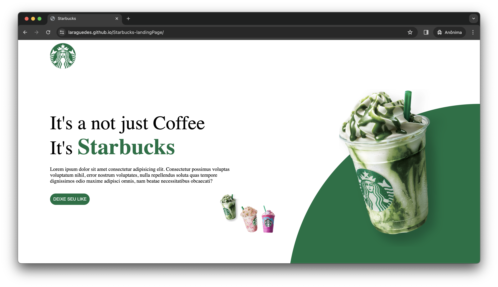
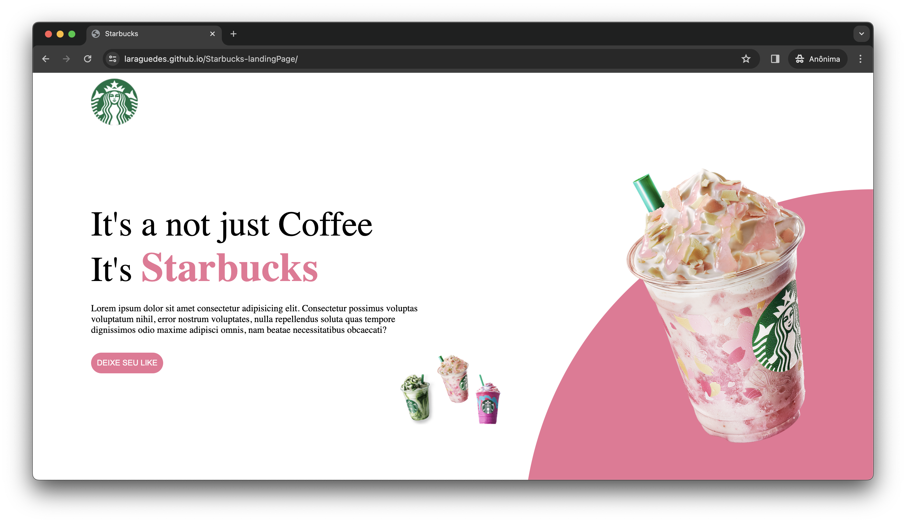
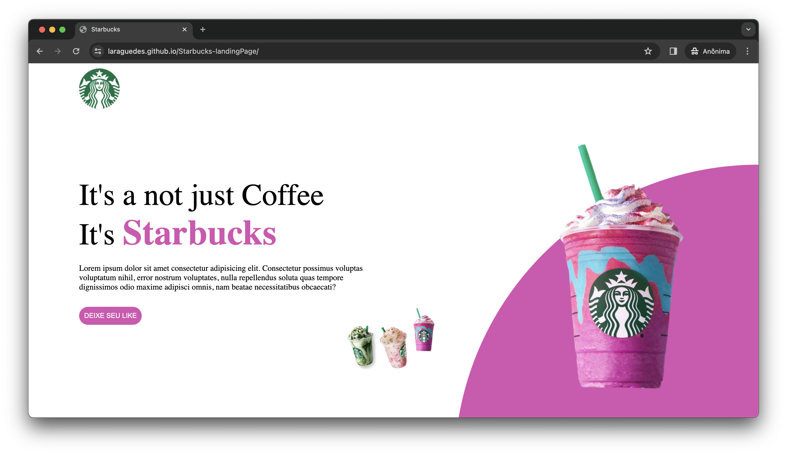

# Starbucks landingPage

## Sobre
O projeto é uma página do Starbucks, que foi desenvolvido durante a missão "Programador do Zero", junto com o Rodolfo Mori . Além de aplicar os conceitos aprendidos em aula, acrescentei detalhes adicionais para enriquecer ainda mais o projeto.

## Tecnologias utilizadas
• Linguagem de marcação HTML; 
• Linguagem de estilização CSS; 
• Linguagem de programação JavaScript.

## Extra
Em busca de aprimorar meus conhecimentos, assisti a um vídeo do professor abordando o processo de deploy utilizando o Netlify vinculado ao GitHub. Como resultado, meu site já está no ar e pronto para ser acessado. Seguem os links abaixo:
 
Deploy: <a href="https://lara-starbucks.netlify.app/">https://lnkd.in/dAPrudkw </a>

## Imagens do projeto

